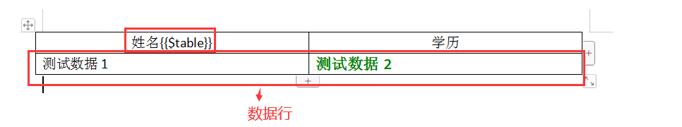
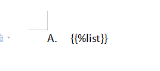

# poi-tl-extended使用文档

## poi-tl-extended介绍

该项目是在已有的第三方库(1.7.2)基础上，在原有代码的基础上增加扩展一些功能。

第三方库源码地址：https://github.com/Sayi/poi-tl

第三方库使用文档地址：[http://deepoove.com/poi-tl/#_2min%E5%85%A5%E9%97%A8](http://deepoove.com/poi-tl/#_2min入门)

poi-tl的优缺点

| 优点                                                         | 缺点                                                         |
| ------------------------------------------------------------ | ------------------------------------------------------------ |
| 能够直接在word中设置需要输出的数据类型，后台只需关注对应的数据组装即可。能够做到所见即所输出 | 1、针对表格和列表的输出，需要设置对应的样式。   2、不支持图表数据的输出。   3、无法更新对应的目录结构 |

## 思考

基于平时报告的流程，由运营人员提供模板，有没有一种方式，能够在提供的模板基础上，只更改word的数据部分，保留对应的样式？通过poi-tl提供的生成方式，想到使用更新策略，采用poi-tl提供的插件接口，使用更新策略。

## 扩展程序

扩展的功能：表格和列表数据的更新。图表（目前仅提供二维柱状图、条形图、折线图、饼图、面积图、环形图）和目录（不是很完美）的生成

### 引入项目

maven方式

```xml
<dependency>
    <groupId>com.github.xiao1wang.poitlextended</groupId>
    <artifactId>poi-tl-extended</artifactId>
    <version>1.0.7</version>
</dependency>
```

### 增加的标签

#### 图表

```
图表标签以&开始：{{&var}} 
```

> 注意：书写的值，需要和模板提供的图表处于同一行

Word中图表的样式


```json
                                    数据模型
{
	"chartList": [{❶
		"chartType": "DOUGHNUT",❷
		"endPosition": 1,❸
		"startPosition": 1❹
	}],
	"colArr": [],❺
	"rowList": [❻
		["僵尸软件", 12],
		["Web攻击", 13],
		["木马程序", 15],
		["蠕虫攻击", 16]
	],
	"title": ""❼
}
```

| ❶    | 图表中涉及到的多种图表集合            |
| ---- | ------------------------------------- |
| ❷    | 单个图表对应的形状                    |
| ❸    | 单个图表的数据，是从excel的第几列开始 |
| ❹    | 单个图表的数据，是从excel的第几列结束 |
| ❺    | excel中的表头                         |
| ❻    | excel中对应的数据行                   |
| ❼    | 图表的标题                            |

```java
								代码格式
								
String title = "个人金额";
String[] titleArr = {"姓名","销售额"};
List<Object[]> list = new ArrayList<>();
list.add(new Object[]{"僵尸软件",12});
list.add(new Object[]{"Web攻击",13});
list.add(new Object[]{"木马程序",15});
list.add(new Object[]{"蠕虫攻击",16});
List<ChartTypeData> chartList = new ArrayList<>();
chartList.add(new ChartTypeData(ChartType.DOUGHNUT,1,1));
ChartRenderData firstchart = new ChartRenderData(null, null, list, chartList);
map.put("firstchart", firstchart);
```

#### 表格

```
表格标签以$开始：{{$var}} 
```

> 注意：书写的值，需要放在表格中的某一个单元格内，并且需要至少保留一行有数据的内容，底层需要更加这一行的格式，生成其余的样式

Word中表格的样式




```json
                                    数据模型
{
	"rowList": [❶
		["张三", "博士生"],
		["李四", "硕士"],
		["王五", "本科"]
	],
	"start": 1❷
}
```

| ❶    | 列表中数据行的集合 |
| ---- | ------------------ |
| ❷    | 数据行从第几行开始 |

```java
								代码格式
								
List<Object[]> list = new ArrayList<>();
list.add(new String[]{"张三", "博士生"});
list.add(new String[]{"李四", "硕士"});
list.add(new String[]{"王五", "本科"});
dataMap.put("table", new TableRenderData(1,list));
```
#### 列表

```
列表标签以%开始：{{%var}} 
```

> 注意：书写的值，需要放在第一个列表内

Word中列表的样式



#### 目录

由于目录的生成方式特别，因此提供专门的工具类，用于在文档其他数据生成后，单独调用。

生成目录的方式：
##### 自动方式

代码如下：

```java
public static void main(String[] args) throws Exception {
        CustomerTOC.automaticGenerateTOC(3, "toc", doc,2);
    }
```
解释：
3     代表文档的标题级别
"toc" 代表文档中需要替换为目录的占位符  
doc   代表当前文档
2     代表从第几页开始计算页数

> 不足之处：读取文档在前，由于设置数据导致当前文档的结构发生改变，但是程序动态识别对应的分页符。导致还是按照之前的文档结构生成

##### 手动方式

代码如下：

```java
public static void main(String[] args) throws Exception {
        CustomerTOC.handGenerateTOC(doc, "toc");
    }
```
解释：
doc   代表当前文档
"toc" 代表文档中需要替换为目录的占位符

> 不足之处：第一次打开文档时，提示用户需要更新文档域，需要选择“是”，才能生成文档。

## word使用Sping表达式

```
{{name}}❶
{{name.toUpperCase()}} ❷
{{$['table']}}❸
```
| ❶❷   | 前两种适用Bean的模式，例如模板渲染的是一个对象template.render(Bean); |
| ---- | ------------------------------------------------------------ |
| ❸    | 最后一种Map的模式，例如模板渲染的是一个对象template.render(map); |

> 默认Spring表达式，需要用户自己判定变量是否为空，错误处理会遵循SpringEL的规则抛出异常，为了不用再输出数据时，增加用户判断，提供了另一种标签处理机制。使用方法如下：
>
> ```java
> ConfigureBuilder builder = Configure.newBuilder();
> // 采用spring El语法，针对无法计算的值，直接输出为null
> builder.setElMode(Configure.ELMode.SIMPLE_SPEL_MODE);
> // 得到模板文件
> XWPFTemplate template = XWPFTemplate.compile(
> ChartTest.class.getClassLoader().getResource("templates/template_table.docx").getPath(), builder.build());
> ```
>
> 
